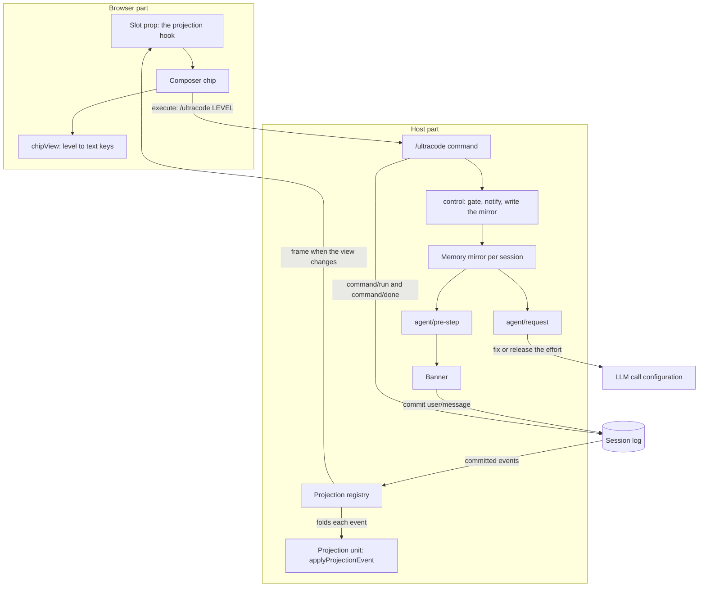

# Ultracode plugin architecture

English | [中文](architecture.zh.md)

This document describes how `@dessera/dsh-ultracode` is built, what each module owns, and which
constraints the surrounding DeepSeek Harness places on it. It describes the code as it stands in
`src/`; every statement below is a statement about a symbol or a file in this repository.

## What the plugin does

The plugin gives one session a three-position level. The level is the plugin's only product state,
and it has exactly two effects.

- It selects the instruction block that is injected into a substantive user turn, directly after the
  last message the human wrote.
- While the level is not `off`, it raises the reasoning effort of that session's requests to the
  strongest value the route reported when the effort was fixed.

| Level   | Instruction injected after the last human message of a substantive turn                                                                   | Reasoning effort                                                             |
| ------- | ----------------------------------------------------------------------------------------------------------------------------------------- | ---------------------------------------------------------------------------- |
| `off`   | Nothing is injected.                                                                                                                      | No effort is fixed, and returning to `off` releases the effort the plugin raised. |
| `high`  | The `high` block: a few parallel perspectives, then one adversarial refutation pass.                                                      | Fixed at the strongest effort the route reported when the effort was fixed.  |
| `ultra` | The `ultra` block: a wide fan-out, rounds that stop only after two consecutive rounds find nothing new, and a closing completeness check. | Fixed at the strongest effort the route reported when the effort was fixed.  |

Two consequences of that table are worth stating plainly, because they are easy to misread.

First, the injected text is the only difference between `high` and `ultra`. Both fix the same
effort, both are gated identically, and both leave the model free to answer directly instead of
calling the workflow tool.

Second, the words `Effort: HIGH` and `Effort: ULTRA` inside the injected text are instructions to
the model about how to shape a workflow run. They are not the reasoning-effort setting. The
reasoning-effort setting is a call configuration field that the plugin writes separately, as
described below.

## The two parts

The package ships two artifacts, built from two source trees.

| Part   | Source          | Artifact        | Runtime                                                                                                        |
| ------ | --------------- | --------------- | -------------------------------------------------------------------------------------------------------------- |
| Host   | `src/host/**`   | `lib/index.js`  | Node ESM (ECMAScript modules), loaded by the plugin's loader row in the host process.                          |
| Client | `src/client/**` | `lib/client.js` | A browser bundle in the `__ModuleLoader__.load({ id, factory })` handshake form, injected into the web client. |

Both artifacts inline one copy of `src/host/protocol.ts`, which is why that module carries no runtime
imports — its single import is type-only and erases: an import of a host package there would be
inlined into the browser bundle along with that package's top-level side effects.

The host part and the client part never call each other. They agree on a vocabulary and one data
format, and the harness carries values between them.

## Source layout

| File                              | Responsibility                                                                                                                                                                                     |
| --------------------------------- | -------------------------------------------------------------------------------------------------------------------------------------------------------------------------------------------------- |
| `src/host/index.ts`               | Plugin entry point. Resolves configuration, registers the command, the pre-step and request waterfalls and the projection unit, and owns the per-session memory mirror and the effort plan caches. |
| `src/host/config.ts`              | Configuration defaults and resolution. Depends on nothing, so it is unit-testable without a host.                                                                                                  |
| `src/host/schema.ts`              | The loader-facing schema that validates a deployment's configuration row. It applies the same defaults as `config.ts`.                                                                             |
| `src/host/protocol.ts`            | The vocabulary both parts share: plugin id, command name, projection key, level vocabulary and aliases, rotation rule, wire shape, and the hand-written parsers.                                  |
| `src/host/reducer.ts`             | The pure log fold (`applyProjectionEvent`) and the command-argument classifier (`classifyCommandArgs`).                                                                                            |
| `src/host/projection.ts`          | Builds the projection unit definition that is handed to the registry.                                                                                                                              |
| `src/host/contract.ts`            | Type-only module. Registers the `ultracode` key in the registry's two merge tables and pulls the host packages' context merges into the program.                                                   |
| `src/host/state.ts`               | The per-session memory mirror (`UltracodeStateStore`) and the effort baseline it remembers.                                                                                                        |
| `src/host/effort.ts`              | `EffortResolver`, which decides which effort to fix, and `withEffortPlan`, which applies one decision to a call configuration.                                                                     |
| `src/host/heuristics.ts`          | `isSubstantiveRequest`, the cheap judgement that keeps the banner out of small talk, and the weighted-length measure behind it.                                                                    |
| `src/host/prompt.ts`              | Assembly of the banner text and the per-level instruction blocks.                                                                                                                                  |
| `src/host/message.ts`             | Construction of the one frozen message the plugin injects.                                                                                                                                         |
| `src/host/notices.ts`             | Every user-facing string the host prints, in Chinese and English.                                                                                                                                  |
| `src/client/index.ts`             | Client entry point. Registers the dictionaries and the composer control slot.                                                                                                                      |
| `src/client/UltracodeControl.tsx` | The React control rendered in the composer's right-hand tool row.                                                                                                                                  |
| `src/client/chip.ts`              | `chipView`, the pure function that turns a published value plus local flags into everything the control renders.                                                                                   |
| `src/client/service.ts`           | The write path: `changeLevel` builds the `/ultracode <level>` command line and hands it to the command executor, and `readOutcome` narrows the remote reply.                                       |
| `src/client/locales.ts`           | The two dictionaries. The Chinese dictionary is the source of truth for the key set.                                                                                                               |
| `src/client/contract.ts`          | The control slot props type and the locale-namespace merge.                                                                                                                                        |

## Where the level lives

The level exists in two places, and the split is deliberate.

**The log fold is the authority.** DSH's session projection registry folds every committed session
event through each registered unit and derives a client-visible view from the result. This plugin's
unit derives the level from two things it already finds in the log:

- the command lifecycle (`command/run` followed by `command/done`) that DSH records for every
  `/ultracode` invocation, and
- the source summary of the banner message the plugin itself injected, which is the fallback that
  carries the level for a log that carries no level command at all.

A third-party plugin cannot register a durable event type of its own, so this derivation is what
makes the level durable in the first place. The registry checkpoints each unit's state and restores
it by replaying the log tail, which is why a session that was armed before a host restart comes back
armed.

**The memory mirror keeps the feature working without the registry.** `UltracodeStateStore` holds a
per-session record initialised once from the fold. It exists so that both synchronous decisions stay
answerable from in-process state: whether to inject a banner during the pre-step waterfall, and
whether a request is armed and must carry the effort plan. A deployment that mounts no projection
registry still gets the command channel, the banner injection and the fixed effort; it keeps the
composer control too, but that control has no value to render and stays in its connecting state.

Adoption happens once per session object, before anything writes the mirror, so the mirror cannot
overwrite a level the fold already reports. After adoption the fold stays the authority for what the
user sees, while the mirror answers the two synchronous questions.

## The four host-side behaviours

### Banner injection

`agent/pre-step` inserts one message after the last message a human wrote. The banner is placed
there rather than appended at the end, because the workspace instruction baseline sits at the end of
the batch and a concrete user request should stay more specific than it.

Injection happens only when every one of these holds:

- the waterfall decided to enter the step,
- the session is top-level, meaning it is neither a subagent session nor a delegated child,
- the mirror reports a level other than `off`,
- the configured workflow tool resolves in that session's tool scope,
- the batch contains a human-authored message, and its text passes `isSubstantiveRequest`,
- no banner has been claimed for that turn yet.

The injected message carries the complete block: the `high` or `ultra` instruction, plus one escape
sentence that tells the model to answer directly when the turn turns out to be trivial. Its source
summary is written by `injectionSummary` as `ultracode <level> armed this turn`, which is the line
the fold reads back.

### The reasoning-effort fix

`agent/request` is a waterfall that resolves the call configuration for one request. This plugin
registers a listener that awaits the rest of the waterfall first and then adjusts the resolved
result, so it leaves the provider and the model another listener resolved untouched and writes only
the reasoning-effort field. The value it writes is computed once per arming, so a model switch made
while the level stays armed keeps its own route but not its own effort.

The value comes from the model's own declaration. `EffortResolver` asks
`ctx.llm.resolveModelInfo` for the provider and model the session was armed on and takes the last
non-`off` entry of the reported effort list. It does not hard-code a ranking, because the harness
guarantees that order only as the adapter's preferred display order: the fix assumes the adapter lists
its efforts weakest first, and a route that lists them strongest first makes the fix select the weaker
entry. Lookups are cached per provider and model, including failures, and a route that reports no
usable effort produces no fixed value at all.

The decision is computed once per arming and cached when the route reports a usable effort: the
plugin pre-runs it when a level is selected, and falls back to computing it on the first request of
the armed session, where the resolved configuration is the first readable source of a provider and
model. The plan is then applied on every request while the level stays armed. A route that reports no
usable effort caches nothing, so that decision is derived again on each request of the armed session.

Returning to `off` writes a release plan:

- if the plugin captured a baseline before it first fixed an effort, that value is written back;
- if there is no baseline — the state of a session whose level came back from the log after a host
  restart, because the baseline lived only in the previous process — the field is removed instead,
  so the request falls back to the model's own default rather than keeping the effort the plugin fixed.

The baseline is read from the session's own request header, or from the deployment default model
when the session has not made a request yet. An empty baseline means "clear the field on release".

The plugin does not write the harness's `adapterDefaults` marking. The harness recomputes that
marking from whether the caller supplied the field, so a plugin-supplied value there is ignored, and
the only value the persisted schema admits is `true`.

### The `/ultracode` command

One command, no nested subcommands. Its argument text is classified by `classifyCommandArgs`, which
is the same function the log fold uses, so the command a person types and the command the fold
replays cannot mean different things.

| Input                          | Effect                                                                   | Answer                                                                                                                                                                                      |
| ------------------------------ | ------------------------------------------------------------------------ | ------------------------------------------------------------------------------------------------------------------------------------------------------------------------------------------- |
| nothing, or only blanks        | Advance one level: `off` to `high`, `high` to `ultra`, `ultra` to `off`. | The level notice, or a status line when nothing changed.                                                                                                                                    |
| `off`, `none`, `close`, `关闭` | Switch the level off and release the fixed effort.                       | The `off` notice.                                                                                                                                                                           |
| `high`, `高阶`                 | Switch to `high`.                                                        | The `high` notice.                                                                                                                                                                          |
| `ultra`, `极致`                | Switch to `ultra`.                                                       | The `ultra` notice.                                                                                                                                                                         |
| `status`                       | Change nothing.                                                          | One line: the level the fold reports, or the level the in-process mirror holds when no projection registry is mounted or the fold cannot be read, and whether the workflow tool is visible. |
| anything else                  | Change nothing.                                                          | An unknown-level error followed by the usage line.                                                                                                                                          |

Only the first word is read, it is matched case-insensitively, and the remaining words are ignored.
Selecting the level that is already in effect produces no notice. Arming a session whose agent
cannot see the workflow tool is refused, because such a session would carry an authorization it
cannot act on.

### The projection registration

Once, at plugin start, the plugin registers one projection unit under the key `ultracode`. From then
on the registry owns delivery: it folds committed events through the unit, computes the view, and
notifies its change feed when that view changes; the session-control channel turns that notification
into a frame for every connected browser. This is why no part of the plugin polls, listens for window
focus, or answers a "what changed" question locally.

Registration is best effort. A failure is logged and the rest of the plugin keeps working, because
the command a user may need in order to recover must not depend on the display channel.

## The wire contract

The value that crosses to the browser is intentionally tiny.

```ts
interface UltracodeWire {
    readonly level: UltracodeLevel;
}
```

Three properties of it matter.

- The fold reuses the previous wire object whenever an event cannot change the level, and returns the
  previous state object itself only for an event it does not care about — its own command bookkeeping
  builds a fresh state that still carries that wire. The registry suppresses a frame by comparing the
  view it computes, so reference reuse is what keeps unrelated events from costing a publication.
- The parsers in `protocol.ts` rebuild the value field by field instead of passing their input
  through, so neither the registry's copy nor the browser's copy can hold a reference into host
  memory. A malformed level degrades to `off` rather than throwing, because a control that renders
  `off` is honest while a failed parse would take the whole projection down.
- The state version is `2`. A stored state is restored through that version, and a row whose version
  does not match is unusable: the caller re-reads the log from the beginning instead of trusting the
  checkpoint.

## The browser part

The client part registers one entry in the composer's right-hand tool row. The entry joins the list
slot `conversation.input.right` under the id `dsh-ultracode` with order `20`, which orders it among
the entries of that list; the model selector is a separate single slot that the composer renders
after that list, so the two are not ordered against each other.

Reading and writing use different channels on purpose.

- **Read.** The slot the control occupies receives DSH's projection hook as a prop. The control calls
  it with the key from `protocol.ts` and renders the value it gets back, after checking that the reply
  is an object: a reply that is not an object, or a hook that throws, is treated as nothing published
  yet. It keeps no cache, fetches nothing, and holds no level of its own.
- **Write.** A press asks the host to run the command a person would have typed, through
  `ctx.remote.commands.execute`. The control computes the next level itself and sends that level
  explicitly; the level it displays still comes back only through the projection.

`chipView` is the single place where a level reaches the screen. Its result is decided by three
inputs — the published value, whether a press is in flight, and whether a writer exists at all — and
it also accepts the text of the last failure, which it does not use, because the control renders that
text beside the chip rather than inside it. A session whose value has not arrived yet is rendered as
a connecting chip that is still pressable, rather than as nothing. A press is refused while one is
already in flight, when the session cannot run the command, or when the slot carries no session id
that says which session the command goes to; the control renders nothing at all for a session that was removed or for a
delegated child session, where there is no user to press it.

Copy lives in `locales.ts` for both languages, and its key union is a compile-time contract: a key
that exists in one language only fails the type check. The control also carries a small fallback
table for the case where the slot is rendered without this plugin's locale namespace registered.

## Configuration

Two fields, both optional, both with defaults applied identically by `config.ts` and `schema.ts`.

| Field              | Default    | Meaning                                                                                                                                                    |
| ------------------ | ---------- | ---------------------------------------------------------------------------------------------------------------------------------------------------------- |
| `workflowToolName` | `workflow` | The name under which this deployment registers the workflow tool. Visibility is resolved through this one name, and a blank value is refused at load time. |
| `language`         | `zh`       | The language of every notice the host prints. Any value other than `en` selects Chinese.                                                                   |

The deployment row itself lives in `cordis.patch.yml`, which the package declares as its bundle
patch. A profile can override the row by id.

## Data flow



## Build and packaging

`tsdown` produces both artifacts and never type-checks; `pnpm typecheck` owns that.

- The host artifact is a Node ESM library built from `src/host/index.ts`. The harness packages it
  names are type-only imports and erase; the one runtime dependency, the schema builder, is bundled
  rather than externalized, because a locally linked plugin resolves bare specifiers from its own
  real path, which sits outside the profile.
- The client artifact is a CJS bundle wrapped in the module-loader handshake. Its declared externals
  are `react`, `react-dom` and the JSX runtime, because the browser platform module table answers
  them and inlining a second copy of React would break hooks; the built artifact ends up requiring
  only React and the JSX runtime. Everything else is bundled.
- The `prepare` script runs the build, so a Git install produces both artifacts.
- `pnpm check` runs lint, typecheck, build and tests in that order. The bundle tests assert against
  `lib/client.js`, so the client part must be built before those tests run.

## Tests

| File                             | Covers                                                                                                                                                                                   |
| -------------------------------- | ---------------------------------------------------------------------------------------------------------------------------------------------------------------------------------------- |
| `test/ultracode.test.mjs`        | The level vocabulary, the state store, the substantive-message heuristic, and the injected text.                                                                                         |
| `test/protocol.test.mjs`         | The shared vocabulary, the pure fold, the reference-reuse rule, and the projection unit definition.                                                                                      |
| `test/config-effort.test.mjs`    | Configuration resolution and the effort planner, including the fixed effort, the release and the field-clearing plan.                                                                     |
| `test/host-schema.test.mjs`      | That the loader schema and the resolver agree on every default they share.                                                                                                               |
| `test/notices.test.mjs`          | The user-facing strings of both languages.                                                                                                                                               |
| `test/host-integration.test.mjs` | The built host bundle driven through a stubbed context: both waterfalls, the command, the projection, and the fixing and release of the effort.                                          |
| `test/client-units.test.mjs`     | The client's plain modules: the chip view and the reply narrowing of the write path.                                                                                                     |
| `test/client-bundle.test.mjs`    | The built client bundle, rendered through a stubbed module loader.                                                                                                                       |
| `test/contract-probe.test.mjs`   | The names the plugin resolves out of the installed harness, which the compiler cannot check, and the rule that the harness type packages are fixed to exact versions in `package.json`. |

Two guards are deliberate. The contract probe fails loudly when no harness installation is
reachable, because a suite that silently checked nothing is worse than a red one. The host bundle
loader refuses an artifact that imports a package by name, because such an artifact would load
whichever copy of the harness the reader resolves rather than the one the profile runs; that loader is
a shared helper under `test/support/` rather than a suite of its own, and the test that exercises the
refusal lives in `test/host-integration.test.mjs`.

## Deliberate limits

These are properties of the current design, not oversights. Each one is recorded here so that a
later change is made knowingly.

- **The plugin fixes effort on top-level sessions only.** Its `agent/request` listener skips every
  other agent, and the workflow tool's `agent()` rejects an `effort` option outright. Agents a
  workflow starts still do not fall back to the model's own default, because the harness copies the
  delegating parent's latest request-header route into the child's own options: a subagent inherits
  the provider, the model and the reasoning effort the parent's header records, and while the session
  is armed that recorded effort is the fixed one. The inherited effort is dropped only when the
  child's options name a different provider or model without naming an effort, in which case the
  selected model resolves its own default.
- **A model switch does not recompute the fixed effort.** The plan is computed once per arming, so a
  session that switches models while its level stays armed keeps asking for the effort id of the route
  it was armed on. When the new model does not declare that effort, the harness refuses the request
  before any provider I/O; returning to `off` and arming again recomputes it.
- **A raise that is neither recorded nor remembered is not possible.** The result of the
  `agent/request` waterfall is exactly what the harness canonicalizes into the durable
  `request/header` event, and the harness carries a caller-chosen effort forward into later requests.
  The only unrecorded path is a value the adapter generates itself, and that path cannot be forced
  to the strongest effort. A per-request boost that leaves the session's recorded effort untouched
  would therefore need a change in the harness.
- **The effort baseline is not durable.** It lives in host memory, so a restart loses it and the
  release clears the field instead of restoring a value it no longer knows.
- **`high` and `ultra` share one fixed effort.** Their only difference is the injected instruction
  block.
- **The level is the only arming path.** There is no separate trigger word, and the command set is
  exactly the table above.
