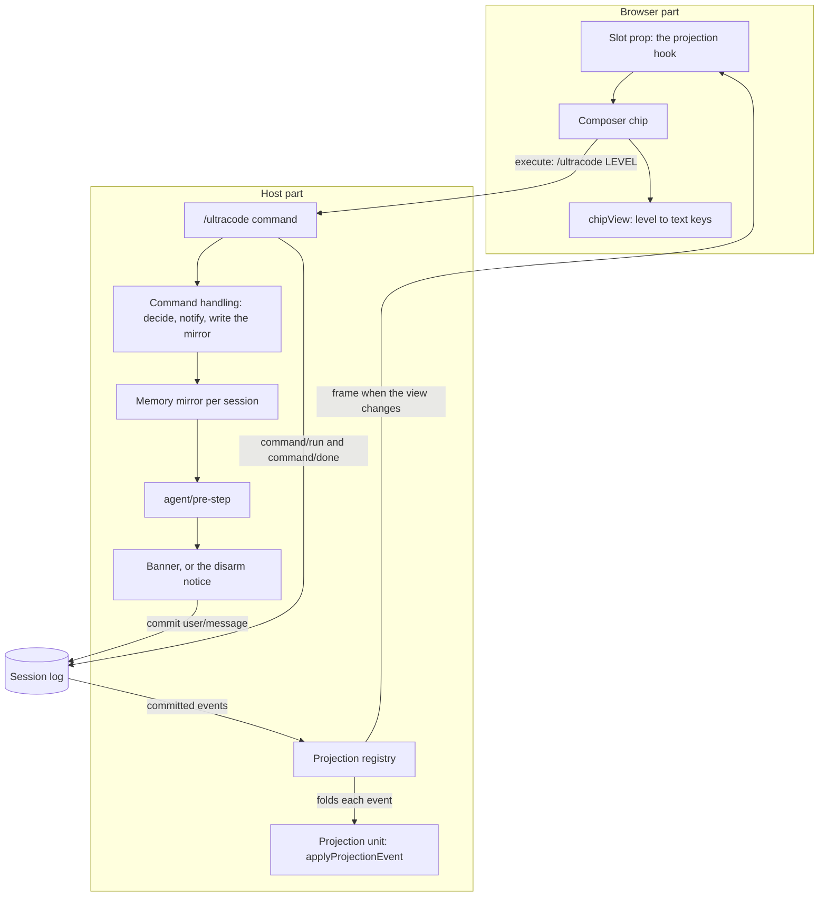

# Ultracode plugin architecture

English | [中文](architecture.zh.md)

This document describes the structure of `@dessera/dsh-ultracode`, the responsibility of each module,
and the constraints the surrounding DeepSeek Harness places on it.

## Plugin behavior

The plugin keeps one level per session, with the values `off`, `high` and `ultra`. The level is the
plugin's only state, and it has exactly one effect: while the level is not `off`, every turn that
session opens carries injected text directly after the message that opened it.

| Level   | Instruction injected after the message that opens a turn                                                                                  |
| ------- | ----------------------------------------------------------------------------------------------------------------------------------------- |
| `off`   | Nothing.                                                                                                                                  |
| `high`  | The `high` block: a few parallel perspectives, then one adversarial refutation pass.                                                      |
| `ultra` | The `ultra` block: a wide fan-out, rounds that stop only after two consecutive rounds find nothing new, and a closing completeness check. |

> The words `Effort: HIGH` and `Effort: ULTRA` inside the injected text are instructions to the model
> and do not change the session's reasoning effort.

The first turn of a level in a session carries the complete block, and every turn after that carries a
one-line reminder; a level change states the complete block again. The two levels differ only in the
prompt text.

Switching the level from `high` or `ultra` back to `off` injects one extra disarm notice.

## The two artifacts and the two source trees

The package ships two artifacts, built from two source trees.

| Part   | Source          | Artifact        | Runtime                                                                                                        |
| ------ | --------------- | --------------- | -------------------------------------------------------------------------------------------------------------- |
| Host   | `src/host/**`   | `lib/index.js`  | Node ESM (ECMAScript modules), loaded by the plugin's loader row in the host process.                          |
| Client | `src/client/**` | `lib/client.js` | A browser bundle in the `__ModuleLoader__.load({ id, factory })` handshake form, injected into the web client. |

Both artifacts inline one copy of `src/host/protocol.ts`. Its single import is type-only and erases,
so the module carries no runtime imports; importing a host package in `protocol.ts` would inline that
package, along with its top-level side effects, into the browser bundle.

The host part and the client part never call each other. They agree on a vocabulary and one data
format, and the harness carries values between them.

## Source modules and responsibilities

| File                              | Responsibility                                                                                                                                                       |
| --------------------------------- | -------------------------------------------------------------------------------------------------------------------------------------------------------------------- |
| `src/host/index.ts`               | Plugin entry point. Resolves configuration, registers the command, the `agent/pre-step` event chain and the projection unit, and owns the per-session memory mirror. |
| `src/host/config.ts`              | Configuration defaults and resolution. Depends on nothing.                                                                                                           |
| `src/host/schema.ts`              | The loader-facing schema that validates a deployment's configuration row.                                                                                            |
| `src/host/protocol.ts`            | The vocabulary both parts share: plugin id, command name, projection key, level vocabulary and aliases, rotation rule, wire shape, and the hand-written parsers.     |
| `src/host/reducer.ts`             | The pure log fold (`applyProjectionEvent`) and the command-argument classifier (`classifyCommandArgs`).                                                              |
| `src/host/projection.ts`          | Builds the projection unit definition that is handed to the registry.                                                                                                |
| `src/host/contract.ts`            | Type-only module. Registers the `ultracode` key in the registry's two merge tables and pulls the host packages' context merges into the program.                     |
| `src/host/state.ts`               | The per-session memory mirror (`UltracodeStateStore`), which also holds the pending disarm notice.                                                                   |
| `src/host/prompt.ts`              | Assembly of the banner text, the per-level instruction blocks, the one-line reminder a repeat turn carries, and the notice a disarmed turn carries.                  |
| `src/host/message.ts`             | Construction of the one frozen message the plugin injects.                                                                                                           |
| `src/host/notices.ts`             | Every user-facing string the host prints, in Chinese and English.                                                                                                    |
| `src/client/index.ts`             | Client entry point. Registers the dictionaries and the composer control slot.                                                                                        |
| `src/client/UltracodeControl.tsx` | The React control rendered in the composer's right-hand tool row.                                                                                                    |
| `src/client/chip.ts`              | `chipView`, the pure function that turns a published value plus local flags into everything the control renders.                                                     |
| `src/client/service.ts`           | The write path: `changeLevel` builds the `/ultracode <level>` command line and hands it to the command executor, and `readOutcome` narrows the remote reply.         |
| `src/client/locales.ts`           | The two dictionaries. The Chinese dictionary is the source of truth for the key set.                                                                                 |
| `src/client/contract.ts`          | The control slot props type and the locale-namespace merge.                                                                                                          |

## Where the level lives

The level exists in two places.

**The log fold decides the level the user sees.** DSH's session projection registry folds every committed session
event through each registered unit and derives a client-visible view from the result. This plugin's
unit derives the level from two things it already finds in the log:

- the command lifecycle (`command/run` followed by `command/done`) that DSH records for every
  `/ultracode` invocation, and
- the source summary of the banner message the plugin itself injected, which is the fallback source
  of the level for a log that carries no level command at all.

A third-party plugin cannot register a durable event type of its own, so this derivation is what
makes the level durable in the first place. The registry checkpoints each unit's state and restores
it by replaying the log tail.

**The memory mirror keeps the feature working without the registry.** `UltracodeStateStore` holds a
per-session record initialised once from the fold. The mirror answers one synchronous decision:
whether the `agent/pre-step` event chain injects a banner during this run. A deployment that mounts no
projection registry still gets the command channel and the banner injection; it keeps the composer
control too, but that control has no value to render and stays in its connecting state.

The plugin adopts the fold's result once per session object, and that adoption happens before anything
writes the mirror, so the mirror cannot overwrite a level the fold already reports. After adoption the
fold always decides what the user sees, while the mirror answers that synchronous question.

## The three host-side behaviours

### Banner injection

`agent/pre-step` inserts one message after the message that opened the turn; the insertion point is
not the end of the batch.

Injection happens only when every one of these holds:

- the `agent/pre-step` event chain decided to enter the step,
- the session is top-level, meaning it is neither a subagent session nor a delegated child,
- the mirror reports a level other than `off`, or the session still owes a disarm notice,
- for an armed turn, the configured workflow tool resolves in that session's tool scope,
- the batch contains an opening message that has not been injected for yet.

The **opening message** is the last message in the batch the inbox handed to this step that does not
stand for the turn's own continuation. Two sources are skipped: a tool result, which continues this
turn rather than opening a new one, and any message this plugin injected — the banner, the one-line
reminder a repeat turn carries, and the disarm notice — because the runtime re-queues the messages
an abandoned step had claimed and anchoring on one of those would inject a second banner for the
same opening. Human messages, `/goal` continuation rounds and runtime notices such as a settled
subagent all count, so every turn an armed session opens is injected however short its message is
and whether or not it is a question.

The complete block is the `high` or `ultra` instruction plus one escape sentence that tells the model
to answer directly when the turn turns out to be trivial. Whether a level has already been injected
lives in host memory and never enters the log, so a host restart or a resume injects the complete
block once more rather than assuming the block is still in the context.

Both forms carry a source summary written by `injectionSummary` as `ultracode <level> armed this
turn`, which is the line the fold reads back; the two forms share that one line.

The turn after a level is switched off carries the notice built by `buildDisarmNotice`, which is
bracketed like the banner but does not open with the `[workflows mode armed.` marker: nothing is
armed, and the notice says so in its own first sentence. It carries no level instruction, so a model
that reads it does not see `Effort: HIGH` or `Effort: ULTRA` in it, and its source summary is written
by `disarmSummary` as `ultracode mode ended before this turn`. That summary names no
level word at all, not even `off`: the fold reads a level out of a summary by looking for a level
word, so a notice naming `high` or `ultra` would read as an arming, and one naming `off` would make a
log that carries no level command fall back to `off` instead of leaving the level an earlier banner
established alone.

The notice is injected once. `UltracodeStateStore.select` records the pending notice when a level
other than `off` becomes `off`, the turn that actually injects it clears it, and any step that meets
its skip conditions before injecting — a refused step, a batch with no opening message, an anchor the
batch does not contain — leaves it pending. Arming the session again discards it. A re-queued opening
message collects the notice once, which the claim keeps idempotent by anchoring it the same way the
banner is anchored. Like the injected level, the pending notice lives in host memory and not in the
log, so a level change that happened before a restart is reported by nothing.

**One banner per turn opening** is decided by the identity of the anchoring message, not by the turn
number. A steer a person types while the agent is already working joins the running turn, leaving the
turn number unchanged while the message is new, so that message still carries a banner of its own. The
disarm notice uses its own anchor field the same way, so a notice never makes a later banner look
already delivered.

### The `/ultracode` command

The plugin registers one command; the command set is the table below. Its argument text is classified
by `classifyCommandArgs`, which is the same function the log fold uses, so the command a person types
and the command the fold replays cannot mean different things.

| Input                          | Effect                                                                   | Answer                                                                                                                                                                                      |
| ------------------------------ | ------------------------------------------------------------------------ | ------------------------------------------------------------------------------------------------------------------------------------------------------------------------------------------- |
| nothing, or only blanks        | Advance one level: `off` to `high`, `high` to `ultra`, `ultra` to `off`. | The level notice, or a status line when nothing changed.                                                                                                                                    |
| `off`, `none`, `close`, `关闭` | Switch the level off.                                                    | The `off` notice.                                                                                                                                                                           |
| `high`, `高阶`                 | Switch to `high`.                                                        | The `high` notice.                                                                                                                                                                          |
| `ultra`, `极致`                | Switch to `ultra`.                                                       | The `ultra` notice.                                                                                                                                                                         |
| `status`                       | Change nothing.                                                          | One line: the level the fold reports, or the level the in-process mirror holds when no projection registry is mounted or the fold cannot be read, and whether the workflow tool is visible. |
| anything else                  | Change nothing.                                                          | An unknown-level error followed by the usage line.                                                                                                                                          |

Only the first word is read, it is matched case-insensitively, and the remaining words are ignored.
Selecting the level that is already in effect produces no notice. A session whose agent cannot see the
`workflow` tool cannot be armed.

### The projection registration

Once, at plugin start, the plugin registers one projection unit under the key `ultracode`. From then
on the registry owns delivery: it folds committed events through the unit, computes the view, and
notifies its change feed when that view changes; the session-control channel turns that notification
into a frame for every connected browser.

Registration is best effort. A failed registration is logged and the rest of the plugin keeps working.

## The wire contract

The value that crosses to the browser carries only the level field.

```ts
/** The state one session's composer control renders. */
export interface UltracodeWire {
    /** The level the host's log fold currently reports. */
    readonly level: UltracodeLevel;
}
```

The wire value has three properties that matter.

- The fold reuses the previous wire object whenever an event cannot change the level, and returns the
  previous state object itself only for an event it does not care about — its own command bookkeeping
  builds a fresh state that still carries that wire. The registry suppresses a frame by comparing the
  view it computes, so reusing the same reference keeps unrelated events from triggering a publication.
- The parsers in `protocol.ts` rebuild the value field by field instead of passing their input
  through, so neither the registry's copy nor the browser's copy can hold a reference into host
  memory. A malformed level degrades to `off` rather than throwing: a failed parse would make the
  whole projection unusable.
- The state version is `2`. A stored state is restored through that version, and a row whose version
  does not match is unusable: the caller re-reads the log from the beginning instead of trusting the
  checkpoint.

## The browser part

The client part registers one entry in the composer's right-hand tool row. The entry joins the list
slot `conversation.input.right` under the id `dsh-ultracode` with order `20`, which orders it among
the entries of that list; the model selector is a separate single slot that the composer renders
after that list, so the two are not ordered against each other.

Reading and writing use different channels.

- **Read.** The slot the control occupies receives DSH's projection hook as a prop. The control calls
  it with the key from `protocol.ts` and renders the value it gets back, after checking that the reply
  is an object: a reply that is not an object, or a hook that throws, is treated as nothing published
  yet. The level the control needs comes entirely from that projection hook.
- **Write.** A press asks the host to run the command a person would have typed, through
  `ctx.remote.commands.execute`. The control computes the next level itself and sends that level
  explicitly; the level it displays still comes back only through the projection.

`chipView` is the single place where a level reaches the screen. Its result is decided by three
inputs: the published value, whether a press is in flight, and whether a writer exists at all. It
also accepts the text of the last failure but does not use it; the control renders that text beside
the chip rather than inside it. A session whose value has not arrived yet is rendered as a connecting
chip that is still pressable, rather than as nothing. A press is refused while one is already in
flight, when the session cannot run the command, or when the slot carries no session id that names
the target session. The control renders nothing at all for a session that was removed or for a
delegated child session, where there is no user to press it.

Copy lives in `locales.ts` for both languages, and its key union is a compile-time contract: a key
that exists in one language only fails the type check. The control also carries a fallback copy table
for the case where the slot is rendered without this plugin's locale namespace registered.

## Configuration

Two fields, both optional, both with defaults applied identically by `config.ts` and `schema.ts`.

| Field              | Default    | Meaning                                                                                                                                                            |
| ------------------ | ---------- | ------------------------------------------------------------------------------------------------------------------------------------------------------------------ |
| `workflowToolName` | `workflow` | The name under which this deployment registers the workflow tool. Visibility is resolved through this one name, and a blank value is refused at load time.         |
| `language`         | `zh`       | The language of every notice the host prints. The available values are `zh` and `en`, and the loader refuses any other value when it validates the deployment row. |

The deployment row itself lives in `cordis.patch.yml`, which the package declares as its bundle
patch. A profile can override the row by id.

## Data flow

The diagram gives the path of one level change: the control hands `/ultracode <level>` to the command,
the command writes the memory mirror and lands on the session log's command lifecycle; the mirror
feeds the `agent/pre-step` decision about whether to inject; the injected message and the command
events both enter the session log; the projection registry folds the log and sends a frame to the slot
the control occupies when the view changes.


```mermaid
flowchart TB
    subgraph browser[Browser part]
        seat["Slot prop: the projection hook"]
        chip[Composer chip]
        view["chipView: level to text keys"]
        seat --> chip
        chip --> view
    end

    subgraph host[Host part]
        command["/ultracode command"]
        control["Command handling: decide, notify, write the mirror"]
        mirror["Memory mirror per session"]
        prestep["agent/pre-step"]
        banner["Banner, or the disarm notice"]
        registry["Projection registry"]
        unit["Projection unit: applyProjectionEvent"]
    end

    log[(Session log)]

    chip -- "execute: /ultracode LEVEL" --> command
    command --> control
    control --> mirror
    mirror --> prestep
    prestep --> banner
    banner -- "commit user/message" --> log
    command -- "command/run and command/done" --> log
    log -- "committed events" --> registry
    registry -- "folds each event" --> unit
    registry -- "frame when the view changes" --> seat
```

## Build and packaging

`tsdown` builds both artifacts from the `tsdown.config.ts` in the repository root: the `lib` item
builds the host artifact and the `client` item builds the client artifact. It never type-checks;
`pnpm typecheck` owns that.

- The host artifact is a Node ESM library built from `src/host/index.ts`. The harness packages it
  names are type-only imports and erase; the one runtime dependency, the schema builder, is bundled
  rather than externalized; a locally linked plugin resolves bare specifiers from its own real path,
  which sits outside the profile.
- The client artifact is a CommonJS (CJS) bundle wrapped in the module-loader handshake. Its declared
  externals are `react`, `react-dom` and the JSX runtime (declared in `CLIENT_EXTERNALS` in
  `tsdown.config.ts`); the browser platform module table answers those packages, and inlining a second
  copy of React would break hooks. The built artifact ends up requiring only React and the JSX
  runtime, and everything else is bundled.
- The `prepare` script runs the build, so a Git install produces both artifacts.
- `pnpm check` runs five steps in this order: format checking, lint, typecheck, build and tests.
- `pnpm compat` runs the same test suite against each supported DSH version.
