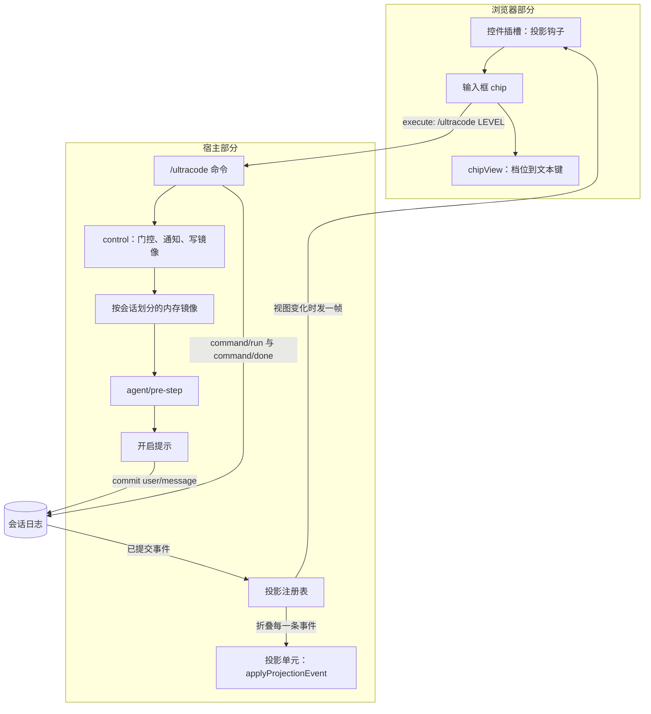

# Ultracode 插件架构

[English](architecture.md) | 中文

本文说明 `@dessera/dsh-ultracode` 是怎么构成的、每个模块负责什么，以及外围的 DeepSeek Harness 给它加了哪些约束。本文描述的是 `src/` 里代码当前的样子；下文每一句陈述，说的都是本仓库里某个符号或某个文件。

## 插件做什么

插件让每个会话拥有一组三个可选的档位。档位是插件唯一的产品状态，它只有一个效果：只要档位不是 `off`，该会话开启的每一个回合都会在开局消息之后拿到一段注入文本。注入位置紧接在开启这一回合的那条消息之后。

| 档位    | 在回合开局消息之后注入的指令                                                             |
| ------- | ---------------------------------------------------------------------------------------- |
| `off`   | 不注入任何内容。                                                                         |
| `high`  | `high` 块：少数几个并行视角，随后一轮对抗式反驳。                                        |
| `ultra` | `ultra` 块：大范围扇出，一轮轮地跑、直到连续两轮都没有新发现才停，最后加一次完整性核查。 |

注入的文本取决于这个档位在本会话里是否已经宣告过。每个档位第一次生效时注入完整块；此后同一档位的每个回合只注入一行简短提醒。档位改变时重新注入完整块，因为 `high` 与 `ultra` 的差别正是那段文本。

这张表带来三个结论，值得直说，因为它们容易被读错。

第一，档位是唯一的门控条件。插件不看消息的长短，也不判断它是不是一个任务：一个提问、一句「继续」、一次自动续跑，都和其他回合一样拿到注入文本。回合里没有开局消息时不注入，因为那一步只是本回合自己的延续。

第二，注入文本里的 `Effort: HIGH` 与 `Effort: ULTRA` 这两个词，是给模型看的指令，告诉它一次 workflow 运行该按什么形态展开。它们不是 harness 的推理强度设置，与那个设置毫无关系。插件只读会话状态、注入提示词、写自己的投影：它不注册 `agent/request` 监听器，也从不写 harness 调用配置里的任何字段，因此一个会话实际使用的推理强度，始终是用户在输入框里选定的那个值。

## 两个部分

这个包发布两个产物，它们由两棵源码树构建而来。

| 部分   | 源码            | 产物            | 运行形态                                                                                         |
| ------ | --------------- | --------------- | ------------------------------------------------------------------------------------------------ |
| 宿主   | `src/host/**`   | `lib/index.js`  | Node ESM（ECMAScript 模块），由宿主进程里插件的 loader 行加载。                                  |
| 客户端 | `src/client/**` | `lib/client.js` | 一个浏览器 bundle，采用 `__ModuleLoader__.load({ id, factory })` 握手形式，被注入到 Web 客户端。 |

两个产物各自内联了一份 `src/host/protocol.ts`，这就是该模块不携带任何运行时导入的原因——它唯一的导入是类型导入并且会被擦除：在那里导入一个宿主包，会把该包连同它的顶层副作用一起内联进浏览器 bundle。

宿主部分与客户端部分从不互相调用。它们共同约定一套词汇和一种数据格式，由 harness 在两者之间传递取值。

## 源码布局

| 文件                              | 职责                                                                                                   |
| --------------------------------- | ------------------------------------------------------------------------------------------------------ |
| `src/host/index.ts`               | 插件入口。它解析配置，注册命令、pre-step 瀑布与投影单元，并掌管按会话划分的内存镜像。                  |
| `src/host/config.ts`              | 配置默认值与解析。它不依赖任何东西，因此不需要宿主就能做单元测试。                                     |
| `src/host/schema.ts`              | 面向 loader 的 schema，用来校验一次部署的配置行。它施加的默认值与 `config.ts` 相同。                   |
| `src/host/protocol.ts`            | 两个部分共享的词汇：插件 id、命令名、投影键、档位词汇与别名、轮转规则、数据格式，以及手写的解析器。    |
| `src/host/reducer.ts`             | 纯日志折叠（`applyProjectionEvent`）与命令参数分类器（`classifyCommandArgs`）。                        |
| `src/host/projection.ts`          | 构造交给注册表的投影单元定义。                                                                         |
| `src/host/contract.ts`            | 纯类型模块。在注册表的两张合并表里注册 `ultracode` 键，并把各宿主包的上下文合并拉进程序。              |
| `src/host/state.ts`               | 按会话划分的内存镜像（`UltracodeStateStore`）。                                                        |
| `src/host/prompt.ts`              | 开启提示的文本与各档位指令块的拼装，以及重复回合用的那一行简短提醒。                                   |
| `src/host/message.ts`             | 构造插件注入的那一条被冻结的消息。                                                                     |
| `src/host/notices.ts`             | 宿主打印的每一条面向用户的字符串，中英双语。                                                           |
| `src/client/index.ts`             | 客户端入口。注册字典与输入框插槽。                                                                     |
| `src/client/UltracodeControl.tsx` | 渲染在输入框右侧工具行里的 React 控件。                                                                |
| `src/client/chip.ts`              | `chipView`，那个把已发布的值加上若干本地标志变成控件所渲染的一切的纯函数。                             |
| `src/client/service.ts`           | 写入路径：`changeLevel` 拼出 `/ultracode <level>` 命令行并交给命令执行器，`readOutcome` 收窄远端回复。 |
| `src/client/locales.ts`           | 两份字典。中文那份是键集合的事实源。                                                                   |
| `src/client/contract.ts`          | 插槽的 props 类型与 locale 命名空间合并。                                                              |

## 档位存在哪里

档位存在于两个地方，这种拆分是有意为之。

**日志折叠是权威。** DSH（DeepSeek Harness）的会话投影注册表把每一条已提交的会话事件穿过每一个已注册单元做折叠，并从结果里推导出一份客户端可见的视图。本插件的单元从它本来就能在日志里找到的两样东西推导出档位：

- DSH 为每一次 `/ultracode` 调用记录的命令生命周期（`command/run` 之后跟着 `command/done`），以及
- 插件自己注入的那段开启提示的来源摘要；对于完全不带档位命令的日志，这条摘要就是承载档位的兜底。

第三方插件无法注册属于自己的持久事件类型，所以正是这条推导路径让档位从一开始就是持久的。注册表会为每个单元的状态做检查点，并通过重放日志尾部来恢复它，这就是宿主重启前处于开启状态的会话回来后仍处于开启状态的原因。

**内存镜像让功能在注册表缺席时照常工作。** `UltracodeStateStore` 持有一份按会话划分的记录，它由折叠初始化一次。它存在的意义，是让那个同步判断始终能从进程内状态回答：pre-step 瀑布期间是否要注入开启提示。一次没有挂载投影注册表的部署，依然能得到命令通道与开启提示注入；它也保留输入框控件，只是那个控件没有值可渲染，会停在连接中的状态。

采用每个会话对象只发生一次，且在有任何东西写入镜像之前发生，所以镜像无法覆盖折叠已经报告的档位。采用之后，折叠始终是用户所见内容的事实源，而镜像负责回答那个同步问题。

## 宿主侧的三个行为

### 开启提示的注入

`agent/pre-step` 在开启这一回合的那条消息之后插入一条消息。开启提示放在那里而不是追加到末尾，因为工作区指令基线位于这一批的最后，而一个具体的用户请求应当比它更具体。

只有下列每一条都成立时才会注入：

- 瀑布决定进入这一步，
- 会话是顶层会话，也就是既不是子智能体会话也不是被委派的子会话，
- 镜像报告的档位不是 `off`，
- 配置指定的 workflow 工具在该会话的工具作用域里能解析到，
- 这一批里含有一条开局消息，且它还没有被注入过。

**开局消息**是本步从收件箱取走的那一批里，从后往前数的第一条不表示「本回合自己的延续」的消息。两类消息被跳过：工具结果，因为它是本回合的延续而不是新的开局；以及插件自己注入的开启提示，因为运行时会把被放弃的一步里取走的消息重新放回收件箱，锚在它上面就会对同一次开局注入第二条。人类消息、`/goal` 的自动续跑消息、以及子智能体结束等运行时的通知都算开局消息，所以一个开启档位的会话里每个回合都会被注入，无论消息多短、是不是提问。

注入的内容取决于这一档是否已经宣告过。该档位第一次生效时注入完整块：`high` 或 `ultra` 的指令块，外加一句跳过提示，告诉模型当这一回合其实很琐碎时就直接作答。此后同一档位的每个回合只注入由 `buildReminder` 写下的一行提醒。档位改变时重新注入完整块，因为两档的差别正是那段指令文本。这条「已宣告过的档位」记在宿主内存里而不入库，因此一次宿主重启或一次恢复会重新宣告一次完整块，而不是假定它还在上下文里。

两种形态的来源摘要都是由 `injectionSummary` 写下的 `ultracode <level> armed this turn`，也就是折叠回读的那一行；它不区分两种形态，因为折叠只关心档位。

**每回合只注入一次**由锚点消息的标识决定，而不是由回合号决定。这是有意的：人在智能体干活时补一句话（`steer`）会并入正在跑的那个回合，回合号不变，但消息是新的，所以它照样拿到自己的那条开启提示。

### `/ultracode` 命令

只有一个命令，没有嵌套子命令。它的参数字本由 `classifyCommandArgs` 分类，而日志折叠用的是同一个函数，因此人输入的命令与折叠重放出来的命令不可能有不同的含义。

| 输入                           | 效果                                                             | 回复                                                                                                             |
| ------------------------------ | ---------------------------------------------------------------- | ---------------------------------------------------------------------------------------------------------------- |
| 空，或只有空白                 | 前进一档：`off` 到 `high`，`high` 到 `ultra`，`ultra` 到 `off`。 | 档位通告；什么都没变时，输出一行状态。                                                                           |
| `off`、`none`、`close`、`关闭` | 关闭档位。                                                       | `off` 通告。                                                                                                     |
| `high`、`高阶`                 | 切换到 `high`。                                                  | `high` 通告。                                                                                                    |
| `ultra`、`极致`                | 切换到 `ultra`。                                                 | `ultra` 通告。                                                                                                   |
| `status`                       | 什么都不改。                                                     | 一行：折叠报告的档位，或在没有挂载投影注册表、或折叠读不出来时进程内镜像持有的档位，以及 workflow 工具是否可见。 |
| 其他任何输入                   | 什么都不改。                                                     | 一条未知档位错误，随后是用法行。                                                                                 |

只读第一个词，匹配时不区分大小写，其余的词一律忽略。选中当前已生效的档位不产生任何通告。给一个其智能体看不到 workflow 工具的会话开启档位会被拒绝，因为这样的会话会带着一份它无法兑现的授权。

### 投影注册

插件启动时注册一个投影单元，键为 `ultracode`，只注册这一次。此后投递由注册表掌管：它把已提交的事件穿过该单元折叠，算出视图，并在视图变化时通知它的变更订阅源；会话控制通道把那个通知变成发给每个已连接浏览器的一帧。这就是为什么插件没有任何部分去轮询、去监听窗口焦点，或在本地回答“什么变了”这个问题。

注册是尽力而为的。失败会被记入日志，插件其余部分照常工作，因为用户可能用来恢复的那条命令，绝不该依赖显示通道。

## 传给浏览器的数据格式

跨到浏览器的那份数据有意做得极小。

```ts
interface UltracodeWire {
    readonly level: UltracodeLevel;
}
```

关于它有三点要紧。

- 当一条事件无法改变档位时，折叠复用先前的数据对象；只有对它不关心的事件，才原样返回先前的状态对象本身——它自己的命令簿记会新造一个状态，而那个状态仍然携带这份数据。注册表通过比较它算出的视图来抑制一帧，因此复用同一个引用正是让无关事件不必付出一次发布代价的原因。
- `protocol.ts` 里的解析器逐字段重建数据，而不是把输入直接透传，因此无论是注册表的副本还是浏览器的副本，都无法持有指向宿主内存的引用。一个格式不合法的档位会降级为 `off` 而不是抛错，因为渲染成 `off` 的控件是诚实的，而一次解析失败会把整个投影拖垮。
- 状态版本是 `2`。存储的状态要通过该版本恢复，版本对不上的行不可用：调用方从头重读日志，而不是相信那个检查点。

## 浏览器部分

客户端部分在输入框右侧的工具行里注册一个条目。该条目以 id `dsh-ultracode`、顺序 `20` 加入列表 `conversation.input.right`，顺序只决定它在那个列表的条目之间排在哪里；模型选择器是另一个独立的槽位，由输入框在那个列表之后渲染，所以两者之间不排先后。

读与写有意走不同通道。

- **读。** 控件所在的插槽（seat）把 DSH 的投影钩子当作一个 prop 收到。控件用 `protocol.ts` 里的键调用它，并在确认回复是一个对象之后渲染拿回来的值：回复不是对象、或钩子抛错，都按“还没有发布任何值”处理。它不保留缓存，不抓取任何东西，也不自己持有档位。
- **写。** 一次按下会请求宿主执行一条人本来会亲手输入的命令，经由 `ctx.remote.commands.execute`。控件自己算出下一档，并把那一档明确发出去；它显示出来的档位仍然只通过投影回来。

`chipView` 是档位抵达屏幕的唯一位置。它的结果由三个输入决定——已发布的值、是否有一次按下正在途中、以及到底有没有写入方——它也接受最近一次失败的文本，但不使用它，因为控件把那段文本渲染在 chip 旁边而不是里面。取值尚未到达的会话渲染成一个仍在连接、但依然可按下的 chip，而不是什么都不渲染。当已经有一次按下在途中、当会话无法执行该命令、或当插槽没有会话 id 可以用来指定该命令发给谁时，按下会被拒绝；对于已被移除的会话或委派的子会话，也就是根本没有用户可去按它的地方，控件什么都不渲染。

文案按两种语言放在 `locales.ts` 里，它的键联合是一份编译期契约：只在一种语言里存在的键会让类型检查失败。控件还带一张小的兜底表，用于插槽在没有注册本插件 locale 命名空间的情况下被渲染的场合。

## 配置

两个字段，都可选，默认值由 `config.ts` 与 `schema.ts` 以相同方式施加。

| 字段               | 默认值     | 含义                                                                                 |
| ------------------ | ---------- | ------------------------------------------------------------------------------------ |
| `workflowToolName` | `workflow` | 该部署注册 workflow 工具时使用的名字。可见性通过这一个名字解析，空值在加载时被拒绝。 |
| `language`         | `zh`       | 宿主打印的每一条通告所用语言。任何不是 `en` 的取值都选中中文。                       |

部署行本身放在 `cordis.patch.yml` 里，该文件是包声明为 bundle patch 的文件。profile 可以按 id 覆盖那一行。

## 数据流



## 构建与打包

`tsdown` 产出两个产物，并且从不做类型检查；类型检查由 `pnpm typecheck` 负责。

- 宿主产物是一个由 `src/host/index.ts` 构建出来的 Node ESM 库。它点名的 harness 包都是类型导入并且会被擦除；唯一的运行时依赖是 schema 构造器，它被一起打包而不是外部化，因为一个以本地链接方式安装的插件会从它自己真实的路径解析裸标识符，而那条路径位于 profile 之外。
- 客户端产物是一个包在模块加载器握手里的 CJS bundle。它声明的外部依赖是 `react`、`react-dom` 与 JSX 运行时，因为浏览器平台模块表能应答它们，而内联第二份 React 会破坏 hooks；构建出来的产物最终只 require React 与 JSX 运行时。其余全部打包进去。
- `prepare` 脚本会跑构建，因此一次 Git 安装就能产出两个产物。
- `pnpm check` 按这个顺序跑 lint、类型检查、构建与测试。打包测试断言的对象是 `lib/client.js`，所以客户端部分必须在跑这些测试之前构建好。

## 测试

| 文件                             | 覆盖的内容                                                                                                                         |
| -------------------------------- | ---------------------------------------------------------------------------------------------------------------------------------- |
| `test/ultracode.test.mjs`        | 档位词汇、状态存储、注入的两种文本形态，以及开启提示本身。                                                                         |
| `test/protocol.test.mjs`         | 共享词汇、纯折叠、引用复用规则，以及投影单元定义。                                                                                 |
| `test/host-schema.test.mjs`      | loader schema 与解析器在它们共享的每一个默认值上一致。                                                                             |
| `test/notices.test.mjs`          | 两种语言里面向用户的字符串。                                                                                                       |
| `test/host-integration.test.mjs` | 构建出的宿主 bundle 在一个打桩上下文里被驱动：pre-step 瀑布、命令与投影。                                                          |
| `test/client-units.test.mjs`     | 客户端那些普通模块：chip 视图与写入路径的回复收窄。                                                                                |
| `test/client-bundle.test.mjs`    | 构建出的客户端 bundle，通过一个打桩的模块加载器渲染。                                                                              |
| `test/contract-probe.test.mjs`   | 插件从已安装 harness 里解析出来的那些名字（编译器无法检查它们），以及 harness 类型包在 `package.json` 里被固定到确切版本这条规则。 |

有两处守卫是有意为之。当找不到任何可达的 harness 安装时，契约探针会大声失败，因为一个悄悄什么都没检查的测试套件，比一个红的套件更糟；持续集成那一趟会装好一份 harness 安装，好让这个守卫有东西可读。宿主 bundle 加载器会拒绝任何按包名导入的产物，因为这样的产物会加载读代码的人所解析到的任意一份 harness，而不是该 profile 实际运行的那一份；那个加载器是 `test/support/` 下的共享辅助件，而不是一个独立的套件，行使该拒绝的测试放在 `test/host-integration.test.mjs` 里。

## 有意的边界

以下是当前设计的固有性质，而不是疏忽。每一条都记在这里，好让日后改动是有意识做出的。

- **插件不介入 harness 的调用配置。** 它不注册 `agent/request` 监听器，因此一次请求的 provider、model 与推理强度都不会被本插件改动。推理强度始终是用户在输入框里选定的那个值，而注入文本里的 `Effort: HIGH` 与 `Effort: ULTRA` 两个词是给模型的指令，与那个设置毫无关系。
- **`high` 与 `ultra` 的差别只在于注入的指令块。** 插件对两档的门控条件完全相同，只是各注入一块指令；在其他任何方面，它对两档一视同仁。
- **档位是唯一的门控条件。** 插件不检查消息的长短，也不判断它是不是一个任务：只要档位不是 `off`，该会话开启的每一个回合都会被注入。真正让模型不必编排的，是注入文本里那句跳过提示，而不是插件对消息的猜测。
- **档位是唯一的开启路径。** 没有独立的触发词，命令集合恰好就是上面那张表。
