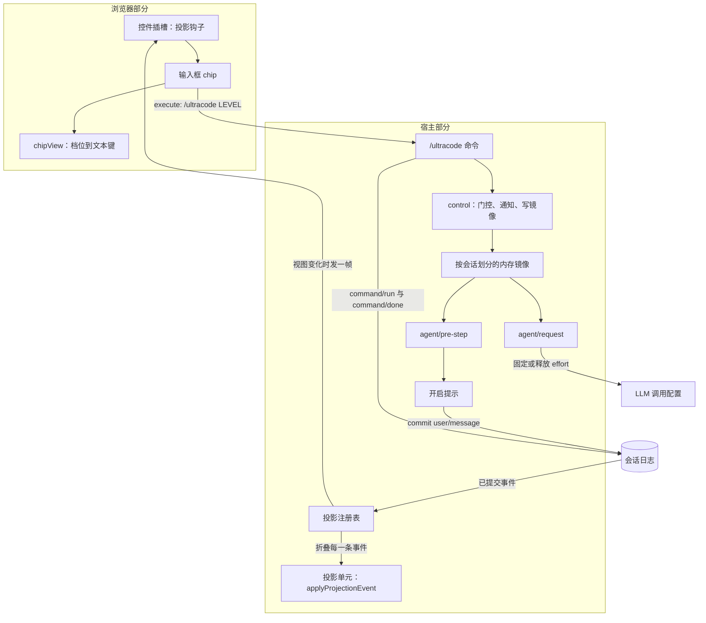

# Ultracode 插件架构

[English](architecture.md) | 中文

本文说明 `@dessera/dsh-ultracode` 是怎么构成的、每个模块负责什么，以及外围的 DeepSeek Harness 给它加了哪些约束。本文描述的是 `src/` 里代码当前的样子；下文每一句陈述，说的都是本仓库里某个符号或某个文件。

## 插件做什么

插件让每个会话拥有一组三个可选的档位。档位是插件唯一的产品状态，它恰好产生两个效果。

- 它决定注入到一次实质性用户回合里的指令块是哪一块，注入位置紧接在人写下的最后一条消息之后。
- 只要档位不是 `off`，它就把该会话请求的推理强度提高到固定强度那一刻路由自报的最强值。

| 档位    | 在实质性回合的最后一条人类消息之后注入的指令                                                                                              | 推理强度                                                 |
| ------- | ----------------------------------------------------------------------------------------------------------------------------------------- | -------------------------------------------------------- |
| `off`   | 不注入任何内容。                                                                                                                          | 不固定强度；回到 `off` 会释放插件此前提高的强度。        |
| `high`  | `high` 块：少数几个并行视角，随后一轮对抗式反驳。                                                                                         | 固定为计算固定值那一刻路由自报的最强强度。               |
| `ultra` | `ultra` 块：大范围扇出，一轮轮地跑、直到连续两轮都没有新发现才停，最后加一次完整性核查。                                                  | 固定为计算固定值那一刻路由自报的最强强度。               |

这张表带来两个结论，值得直说，因为它们容易被读错。

第一，注入文本是 `high` 与 `ultra` 之间唯一的差别。两者固定同一个强度，两者的门控条件完全相同，两者都让模型可以自由地直接作答，而不是必须调用 workflow 工具。

第二，注入文本里的 `Effort: HIGH` 与 `Effort: ULTRA` 这两个词，是给模型看的指令，告诉它一次 workflow 运行该按什么形态展开。它们不是推理强度设置。推理强度设置是一个调用配置字段，由插件单独写入，下文会说明。

## 两个部分

这个包发布两个产物，它们由两棵源码树构建而来。

| 部分   | 源码            | 产物            | 运行形态                                                                                                       |
| ------ | --------------- | --------------- | -------------------------------------------------------------------------------------------------------------- |
| 宿主   | `src/host/**`   | `lib/index.js`  | Node ESM（ECMAScript 模块），由宿主进程里插件的 loader 行加载。                                                |
| 客户端 | `src/client/**` | `lib/client.js` | 一个浏览器 bundle，采用 `__ModuleLoader__.load({ id, factory })` 握手形式，被注入到 Web 客户端。               |

两个产物各自内联了一份 `src/host/protocol.ts`，这就是该模块不携带任何运行时导入的原因——它唯一的导入是类型导入并且会被擦除：在那里导入一个宿主包，会把该包连同它的顶层副作用一起内联进浏览器 bundle。

宿主部分与客户端部分从不互相调用。它们共同约定一套词汇和一种数据格式，由 harness 在两者之间传递取值。

## 源码布局

| 文件                              | 职责                                                                                                                                                                    |
| --------------------------------- | ----------------------------------------------------------------------------------------------------------------------------------------------------------------------- |
| `src/host/index.ts`               | 插件入口。解析配置，注册命令、pre-step 与 request 两个瀑布以及投影单元，并掌管按会话划分的内存镜像与 effort 计划缓存。                                                  |
| `src/host/config.ts`              | 配置默认值与解析。它不依赖任何东西，因此不需要宿主就能做单元测试。                                                                                                      |
| `src/host/schema.ts`              | 面向 loader 的 schema，用来校验一次部署的配置行。它施加的默认值与 `config.ts` 相同。                                                                                    |
| `src/host/protocol.ts`            | 两个部分共享的词汇：插件 id、命令名、投影键、档位词汇与别名、轮转规则、数据格式，以及手写的解析器。                                                                       |
| `src/host/reducer.ts`             | 纯日志折叠（`applyProjectionEvent`）与命令参数分类器（`classifyCommandArgs`）。                                                                                        |
| `src/host/projection.ts`          | 构造交给注册表的投影单元定义。                                                                                                                                          |
| `src/host/contract.ts`            | 纯类型模块。在注册表的两张合并表里注册 `ultracode` 键，并把各宿主包的上下文合并拉进程序。                                                                               |
| `src/host/state.ts`               | 按会话划分的内存镜像（`UltracodeStateStore`）以及它记住的 effort 基线。                                                                                                 |
| `src/host/effort.ts`              | `EffortResolver`，决定固定哪个强度；以及 `withEffortPlan`，把一次决定施加到一个调用配置上。                                                                              |
| `src/host/heuristics.ts`          | `isSubstantiveRequest`，那个把开启提示挡在闲聊之外的廉价判断，以及它背后的加权长度度量。                                                                                |
| `src/host/prompt.ts`              | 开启提示的文本与各档位指令块的拼装。                                                                                                                                    |
| `src/host/message.ts`             | 构造插件注入的那一条被冻结的消息。                                                                                                                                      |
| `src/host/notices.ts`             | 宿主打印的每一条面向用户的字符串，中英双语。                                                                                                                            |
| `src/client/index.ts`             | 客户端入口。注册字典与输入框插槽。                                                                                                                                      |
| `src/client/UltracodeControl.tsx` | 渲染在输入框右侧工具行里的 React 控件。                                                                                                                                 |
| `src/client/chip.ts`              | `chipView`，那个把已发布的值加上若干本地标志变成控件所渲染的一切的纯函数。                                                                                              |
| `src/client/service.ts`           | 写入路径：`changeLevel` 拼出 `/ultracode <level>` 命令行并交给命令执行器，`readOutcome` 收窄远端回复。                                                                  |
| `src/client/locales.ts`           | 两份字典。中文那份是键集合的事实源。                                                                                                                                    |
| `src/client/contract.ts`          | 插槽的 props 类型与 locale 命名空间合并。                                                                                                                               |

## 档位存在哪里

档位存在于两个地方，这种拆分是有意为之。

**日志折叠是权威。** DSH（DeepSeek Harness）的会话投影注册表把每一条已提交的会话事件穿过每一个已注册单元做折叠，并从结果里推导出一份客户端可见的视图。本插件的单元从它本来就能在日志里找到的两样东西推导出档位：

- DSH 为每一次 `/ultracode` 调用记录的的命令生命周期（`command/run` 之后跟着 `command/done`），以及
- 插件自己注入的那段开启提示的来源摘要；对于完全不带档位命令的日志，这条摘要就是承载档位的兜底。

第三方插件无法注册属于自己的持久事件类型，所以正是这条推导路径让档位从一开始就是持久的。注册表会为每个单元的状态做检查点，并通过重放日志尾部来恢复它，这就是宿主重启前处于开启状态的会话回来后仍处于开启状态的原因。

**内存镜像让功能在注册表缺席时照常工作。** `UltracodeStateStore` 持有一份按会话划分的记录，它由折叠初始化一次。它存在的意义，是让两个同步判断始终能从进程内状态回答：pre-step 瀑布期间是否要注入开启提示，以及一次请求是否处于开启状态、是否必须带上 effort 计划。一次没有挂载投影注册表的部署，依然能得到命令通道、开启提示注入与 effort 固定值；它也保留输入框控件，只是那个控件没有值可渲染，会停在连接中的状态。

采用每个会话对象只发生一次，且在有任何东西写入镜像之前发生，所以镜像无法覆盖折叠已经报告的档位。采用之后，折叠始终是用户所见内容的事实源，而镜像负责回答那两个同步问题。

## 宿主侧的四个行为

### 开启提示的注入

`agent/pre-step` 在人写下的最后一条消息之后插入一条消息。开启提示放在那里而不是追加到末尾，因为工作区指令基线位于这一批的最后，而一个具体的用户请求应当比它更具体。

只有下列每一条都成立时才会注入：

- 瀑布决定进入这一步，
- 会话是顶层会话，也就是既不是子智能体会话也不是被委派的子会话，
- 镜像报告的档位不是 `off`，
- 配置指定的 workflow 工具在该会话的工具作用域里能解析到，
- 这一批里含有一条人类写的消息，且其文本通过 `isSubstantiveRequest`，
- 这一回合还没有提示被注入过。

注入的消息携带完整的内容：`high` 或 `ultra` 的指令块，外加一句跳过提示，告诉模型当这一回合其实很琐碎时就直接作答。它的来源摘要是由 `injectionSummary` 写下的 `ultracode <level> armed this turn`，也就是折叠回读的那一行。

### 推理强度的固定

`agent/request` 是一个瀑布，它为一次请求解析调用配置。本插件注册的监听器先等待瀑布剩余部分跑完，再调整已解析出来的结果，因此它不去碰另一个监听器解析出的 provider 与 model，只写推理强度字段。它写入的值在每次开启档位时只计算一次，所以档位保持开启期间切换模型，会保住自己的路由，但保不住自己的强度。

这个值来自模型自己的声明。`EffortResolver` 向 `ctx.llm.resolveModelInfo` 询问该会话开启档位时所依据的 provider 与 model，并取所报强度列表里最后一个非 `off` 的条目。它不硬编码一个强弱排序，因为 harness 只把那个顺序保证为适配器的偏好显示顺序：固定强度时假定适配器由弱到强列出它的强度，而一条由强到弱列出的路由会让固定值选到较弱的那一项。查询结果按 provider 与 model 缓存，失败也缓存；一条报告不出可用强度的路由，完全不产生固定值。

这个决定在每次开启档位时计算一次，并在路由报告了可用强度时缓存下来：插件在选中档位时就预跑一次，也可以回退到在该已开启会话的第一次请求上计算，因为那时解析出的配置是第一处可读到 provider 与 model 的来源。此后只要档位保持开启，这个计划会施加在每一次请求上。一条报告不出可用强度的路由什么都不缓存，于是那个决定会在该已开启会话的每一次请求上重新推导一遍。

回到 `off` 会写入一个释放计划：

- 如果插件在第一次固定强度之前捕获到了基线，就把那个值写回去；
- 如果没有基线——宿主重启后档位从日志里回来的会话就是这种状态，因为基线只活在先前那个进程里——则改为移除该字段，让请求回落到模型自己的默认值，而不是继续保留被固定的强度。

基线是从会话自己的请求头里读出的；当会话还没有发出过请求时，则从该部署的默认模型读出。空的基线意味着“释放时清空该字段”。

插件不写 harness 的 `adapterDefaults` 标记。harness 会依据调用方是否提供了该字段重新计算那个标记，所以插件在那里提供的值会被忽略，而持久化 schema 允许的唯一取值是 `true`。

### `/ultracode` 命令

只有一个命令，没有嵌套子命令。它的参数字本由 `classifyCommandArgs` 分类，而日志折叠用的是同一个函数，因此人输入的命令与折叠重放出来的命令不可能有不同的含义。

| 输入                          | 效果                                                                    | 回复                                                                                                                                            |
| ----------------------------- | ----------------------------------------------------------------------- | ----------------------------------------------------------------------------------------------------------------------------------------------- |
| 空，或只有空白                | 前进一档：`off` 到 `high`，`high` 到 `ultra`，`ultra` 到 `off`。        | 档位通告；什么都没变时，输出一行状态。                                                                                                          |
| `off`、`none`、`close`、`关闭` | 关闭档位，并释放 effort 固定值。                                        | `off` 通告。                                                                                                                                     |
| `high`、`高阶`                 | 切换到 `high`。                                                         | `high` 通告。                                                                                                                                    |
| `ultra`、`极致`                | 切换到 `ultra`。                                                        | `ultra` 通告。                                                                                                                                   |
| `status`                      | 什么都不改。                                                            | 一行：折叠报告的档位，或在没有挂载投影注册表、或折叠读不出来时进程内镜像持有的档位，以及 workflow 工具是否可见。                                |
| 其他任何输入                  | 什么都不改。                                                            | 一条未知档位错误，随后是用法行。                                                                                                                |

只读第一个词，匹配时不区分大小写，其余的词一律忽略。选中当前已生效的档位不产生任何通告。给一个其智能体看不到 workflow 工具的会话开启档位会被拒绝，因为这样的会话会带着一份它无法兑现的授权。

### 投影注册

插件启动时注册一个投影单元，键为 `ultracode`，只注册这一次。此后投递由注册表掌管：它把已提交的事件穿过该单元折叠，算出视图，并在视图变化时通知它的变更订阅源；会话控制通道把那个通知变成发给每个已连接浏览器的一帧。这就是为什么插件没有任何部分去轮询、去监听窗口焦点，或在本地回答“什么变了”这个问题。

注册是尽力而为的。失败会被记入日志，插件其余部分照常工作，因为用户可能用来恢复的那条命令，绝不该依赖显示通道。

## 传给浏览器的数据格式

跨到浏览器的那份数据有意做得极小。

```ts
interface UltracodeWire {
    readonly level: UltracodeLevel;
}
```

关于它有三点要紧。

- 当一条事件无法改变档位时，折叠复用先前的数据对象；只有对它不关心的事件，才原样返回先前的状态对象本身——它自己的命令簿记会新造一个状态，而那个状态仍然携带这份数据。注册表通过比较它算出的视图来抑制一帧，因此复用同一个引用正是让无关事件不必付出一次发布代价的原因。
- `protocol.ts` 里的解析器逐字段重建数据，而不是把输入直接透传，因此无论是注册表的副本还是浏览器的副本，都无法持有指向宿主内存的引用。一个格式不合法的档位会降级为 `off` 而不是抛错，因为渲染成 `off` 的控件是诚实的，而一次解析失败会把整个投影拖垮。
- 状态版本是 `2`。存储的状态要通过该版本恢复，版本对不上的行不可用：调用方从头重读日志，而不是相信那个检查点。

## 浏览器部分

客户端部分在输入框右侧的工具行里注册一个条目。该条目以 id `dsh-ultracode`、顺序 `20` 加入列表 `conversation.input.right`，顺序只决定它在那个列表的条目之间排在哪里；模型选择器是另一个独立的槽位，由输入框在那个列表之后渲染，所以两者之间不排先后。

读与写有意走不同通道。

- **读。** 控件所在的插槽（seat）把 DSH 的投影钩子当作一个 prop 收到。控件用 `protocol.ts` 里的键调用它，并在确认回复是一个对象之后渲染拿回来的值：回复不是对象、或钩子抛错，都按“还没有发布任何值”处理。它不保留缓存，不抓取任何东西，也不自己持有档位。
- **写。** 一次按下会请求宿主执行一条人本来会亲手输入的命令，经由 `ctx.remote.commands.execute`。控件自己算出下一档，并把那一档明确发出去；它显示出来的档位仍然只通过投影回来。

`chipView` 是档位抵达屏幕的唯一位置。它的结果由三个输入决定——已发布的值、是否有一次按下正在途中、以及到底有没有写入方——它也接受最近一次失败的文本，但不使用它，因为控件把那段文本渲染在 chip 旁边而不是里面。取值尚未到达的会话渲染成一个仍在连接、但依然可按下的 chip，而不是什么都不渲染。当已经有一次按下在途中、当会话无法执行该命令、或当插槽没有会话 id 可以用来指定该命令发给谁时，按下会被拒绝；对于已被移除的会话或委派的子会话，也就是根本没有用户可去按它的地方，控件什么都不渲染。

文案按两种语言放在 `locales.ts` 里，它的键联合是一份编译期契约：只在一种语言里存在的键会让类型检查失败。控件还带一张小的兜底表，用于插槽在没有注册本插件 locale 命名空间的情况下被渲染的场合。

## 配置

两个字段，都可选，默认值由 `config.ts` 与 `schema.ts` 以相同方式施加。

| 字段               | 默认值     | 含义                                                                                                                      |
| ------------------ | ---------- | ------------------------------------------------------------------------------------------------------------------------- |
| `workflowToolName` | `workflow` | 该部署注册 workflow 工具时使用的名字。可见性通过这一个名字解析，空值在加载时被拒绝。                                      |
| `language`         | `zh`       | 宿主打印的每一条通告所用语言。任何不是 `en` 的取值都选中中文。                                                             |

部署行本身放在 `cordis.patch.yml` 里，该文件是包声明为 bundle patch 的文件。profile 可以按 id 覆盖那一行。

## 数据流



## 构建与打包

`tsdown` 产出两个产物，并且从不做类型检查；类型检查由 `pnpm typecheck` 负责。

- 宿主产物是一个由 `src/host/index.ts` 构建出来的 Node ESM 库。它点名的 harness 包都是类型导入并且会被擦除；唯一的运行时依赖是 schema 构造器，它被一起打包而不是外部化，因为一个以本地链接方式安装的插件会从它自己真实的路径解析裸标识符，而那条路径位于 profile 之外。
- 客户端产物是一个包在模块加载器握手里的 CJS bundle。它声明的外部依赖是 `react`、`react-dom` 与 JSX 运行时，因为浏览器平台模块表能应答它们，而内联第二份 React 会破坏 hooks；构建出来的产物最终只 require React 与 JSX 运行时。其余全部打包进去。
- `prepare` 脚本会跑构建，因此一次 Git 安装就能产出两个产物。
- `pnpm check` 按这个顺序跑 lint、类型检查、构建与测试。打包测试断言的对象是 `lib/client.js`，所以客户端部分必须在跑这些测试之前构建好。

## 测试

| 文件                             | 覆盖的内容                                                                                                                                                                               |
| -------------------------------- | -------------------------------------------------------------------------------------------------------------------------------------------------------------------------------------- |
| `test/ultracode.test.mjs`        | 档位词汇、状态存储、实质性消息启发式，以及注入的文本。                                                                                                                                   |
| `test/protocol.test.mjs`         | 共享词汇、纯折叠、引用复用规则，以及投影单元定义。                                                                                                                                       |
| `test/config-effort.test.mjs`    | 配置解析与 effort 规划器，包括固定强度、释放与清空字段的计划。                                                                                                                           |
| `test/host-schema.test.mjs`      | loader schema 与解析器在它们共享的每一个默认值上一致。                                                                                                                                   |
| `test/notices.test.mjs`          | 两种语言里面向用户的字符串。                                                                                                                                                             |
| `test/host-integration.test.mjs` | 构建出的宿主 bundle 在一个打桩上下文里被驱动：两个瀑布、命令、投影，以及 effort 强度的固定与释放。                                                                                       |
| `test/client-units.test.mjs`     | 客户端那些普通模块：chip 视图与写入路径的回复收窄。                                                                                                                                       |
| `test/client-bundle.test.mjs`    | 构建出的客户端 bundle，通过一个打桩的模块加载器渲染。                                                                                                                                     |
| `test/contract-probe.test.mjs`   | 插件从已安装 harness 里解析出来的那些名字（编译器无法检查它们），以及 harness 类型包在 `package.json` 里被固定到确切版本这条规则。                                                          |

有两处守卫是有意为之。当找不到任何可达的 harness 安装时，契约探针会大声失败，因为一个悄悄什么都没检查的测试套件，比一个红的套件更糟。宿主 bundle 加载器会拒绝任何按包名导入的产物，因为这样的产物会加载读代码的人所解析到的任意一份 harness，而不是该 profile 实际运行的那一份；那个加载器是 `test/support/` 下的共享辅助件，而不是一个独立的套件，行使该拒绝的测试放在 `test/host-integration.test.mjs` 里。

## 有意的边界

以下是当前设计的固有性质，而不是疏忽。每一条都记在这里，好让日后改动是有意识做出的。

- **插件只在顶层会话上固定 effort。** 它的 `agent/request` 监听器会跳过其他每一个智能体，而 workflow 工具的 `agent()` 会直接拒绝 `effort` 选项。一次 workflow 启动的智能体仍然不会回落到模型自己的默认值，因为 harness 会把委派方最新的请求头路由复制进子智能体自己的选项：子智能体继承父方请求头记录的 provider、model 与推理强度，而在会话处于开启状态期间，被记录下来的那个强度就是被固定的那个。只有当子智能体的选项点名了一个不同的 provider 或 model 却没有点名强度时，继承来的强度才会被丢掉，此时被选中的模型解析出自己的默认值。
- **切换模型不会重新计算固定值。** 计划在每次开启档位时只计算一次，所以一个在档位保持开启期间切换模型的会话，会继续请求它开启档位时所依据那条路由的强度 id。当新模型没有声明该强度时，harness 会在任何 provider I/O 之前拒绝这次请求；回到 `off` 再开启一次即可重新计算。
- **一次既不被记录也不被记住的提高是不可能的。** `agent/request` 瀑布的结果，恰好就是 harness 规范化成持久 `request/header` 事件的东西，而 harness 会把调用方选定的强度一路带到后续请求里。唯一未被记录的路径是适配器自己生成的值，而那条路径无法被强制拉到最强强度。因此，一次不触碰会话已记录强度的逐请求提升，需要改动 harness。
- **effort 基线不是持久的。** 它活在宿主内存里，所以一次重启就会丢掉它，释放时改为清空该字段，而不是恢复一个它已不再知道的值。
- **`high` 与 `ultra` 共用同一个 effort 固定值。** 它们的唯一差别是注入的指令块。
- **档位是唯一的开启路径。** 没有独立的触发词，命令集合恰好就是上面那张表。
