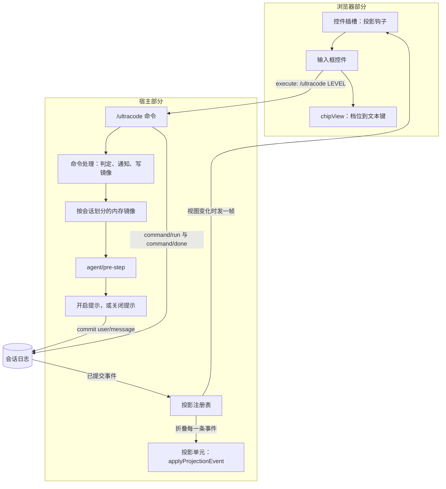

# Ultracode 插件的架构

[English](architecture.md) | 中文

本文说明 `@dessera/dsh-ultracode` 的构成、每个模块的职责，以及外围的 DeepSeek Harness 给这个插件加的约束。

## 插件的功能

插件为每个会话维护一个档位，取值为 `off`、`high`、`ultra`。该档位是插件唯一的状态，且只有一个效果：只要档位不是 `off`，该会话开启的每一个回合都会紧接在开启这一回合的那条消息之后拿到一段注入文本。

| 档位    | 在回合开局消息之后注入的指令                                                                            |
| ------- | ------------------------------------------------------------------------------------------------------- |
| `off`   | 不注入任何内容。                                                                                        |
| `high`  | 插件注入 `high` 块：块内给出少数几个并行视角，随后要求一轮对抗式反驳。                                  |
| `ultra` | 插件注入 `ultra` 块：块内大范围扇出，一轮轮地执行，直到连续两轮都没有新发现才停，最后加一次完整性核查。 |

> 注入文本中的 `Effort: HIGH` 与 `Effort: ULTRA` 是给模型的指令，不改变会话的推理强度。

每个档位在本会话中第一次生效时注入完整块，此后同一档位的每个回合只注入一行简短提醒；档位改变时重新注入完整块。两个档位只有提示词不同。

从 `high` 或 `ultra` 切换回 `off` 时，会额外注入一条关闭提示。

## 两个产物与两棵源码树

这个包发布由两棵源码树构建而来的两个产物。

| 部分   | 源码            | 产物            | 运行形态                                                                                         |
| ------ | --------------- | --------------- | ------------------------------------------------------------------------------------------------ |
| 宿主   | `src/host/**`   | `lib/index.js`  | Node ESM（ECMAScript 模块），由宿主进程中的插件 `loader` 行加载。                                |
| 客户端 | `src/client/**` | `lib/client.js` | 一个浏览器 bundle，采用 `__ModuleLoader__.load({ id, factory })` 握手形式，被注入到 Web 客户端。 |

两个产物各自内联了 `src/host/protocol.ts`。该模块唯一的导入是类型导入，会被擦除，因此该模块不携带任何运行时导入；在 `protocol.ts` 中导入一个宿主包，会把该包连同其顶层副作用一起内联进浏览器 bundle。

宿主部分与客户端部分共同约定一套词汇和一种数据格式，由 harness 在两者之间传递取值。

## 源码模块与职责

| 文件                              | 职责                                                                                                             |
| --------------------------------- | ---------------------------------------------------------------------------------------------------------------- |
| `src/host/index.ts`               | 插件入口。该模块解析配置，注册命令、`agent/pre-step` 事件处理链与投影单元，并掌管按会话划分的内存镜像。          |
| `src/host/config.ts`              | 配置默认值与解析。该模块不依赖任何外部模块。                                                                     |
| `src/host/schema.ts`              | 该文件提供面向 loader 的 schema，用来校验一次部署的配置行。                                                      |
| `src/host/protocol.ts`            | 该模块定义两个部分共享的词汇：插件 id、命令名、投影键、档位词汇与别名、轮转规则、数据格式，以及手写的解析器。    |
| `src/host/reducer.ts`             | 该模块提供纯日志折叠（`applyProjectionEvent`）与命令参数分类器（`classifyCommandArgs`）。                        |
| `src/host/projection.ts`          | 该模块构造交给注册表的投影单元定义。                                                                             |
| `src/host/contract.ts`            | 该文件是纯类型模块，在注册表的两张合并表中注册 `ultracode` 键，并把各宿主包的上下文类型合并引入本程序。          |
| `src/host/state.ts`               | 按会话划分的内存镜像（`UltracodeStateStore`），该镜像也保存那条待注入的关闭提示。                                |
| `src/host/prompt.ts`              | 该模块拼装开启提示的文本与各档位指令块、重复回合用的那一行简短提醒，以及关闭档位后的回合拿到的提示。             |
| `src/host/message.ts`             | 该模块构造插件注入的那一条被冻结的消息。                                                                         |
| `src/host/notices.ts`             | 该模块提供宿主打印的每一条面向用户的字符串，中英双语。                                                           |
| `src/client/index.ts`             | 客户端入口。该文件注册字典与输入框插槽。                                                                         |
| `src/client/UltracodeControl.tsx` | 该文件渲染输入框右侧工具行中的 React 控件。                                                                      |
| `src/client/chip.ts`              | 该文件导出 `chipView`，一个由已发布的值与若干本地标志算出控件全部显示内容的纯函数。                              |
| `src/client/service.ts`           | 该文件实现写入路径：`changeLevel` 拼出 `/ultracode <level>` 命令行并交给命令执行器，`readOutcome` 收窄远端回复。 |
| `src/client/locales.ts`           | 该文件提供两份字典，中文那份是键集合的事实源。                                                                   |
| `src/client/contract.ts`          | 该文件声明插槽的 `props` 类型与 `locale` 命名空间合并。                                                          |

## 档位的存储位置

档位存在于两个位置。

**日志折叠决定用户看到的档位。** DSH（DeepSeek Harness）的会话投影注册表把每一条已提交的会话事件穿过每一个已注册单元做折叠，并从结果中推导出一份客户端可见的视图。本插件的单元从日志中本来就能找到的两个来源推导出档位：

- DSH 为每一次 `/ultracode` 调用记录的命令生命周期（`command/run` 之后跟着 `command/done`），以及
- 插件自己注入的那段开启提示的来源摘要；对于完全不带档位命令的日志，这条摘要就是档位的备用来源。

第三方插件无法注册属于自己的持久事件类型，所以正是这条推导路径让档位从一开始就是持久的。注册表会为每个单元的状态做检查点，并通过重放日志尾部来恢复该状态。

**内存镜像让功能在注册表缺席时仍然可用。** `UltracodeStateStore` 持有一份按会话划分的记录，该记录由折叠初始化一次。镜像回答的是一次同步判断：`agent/pre-step` 事件处理链在本次运行中是否注入开启提示。一次没有挂载投影注册表的部署，依然能得到命令通道与开启提示注入；该部署也保留输入框控件，只是该控件没有值可渲染，会停在连接中的状态。

插件对每个会话对象只采用一次折叠结果，且这次采用发生在任何内容写入镜像之前，所以镜像无法覆盖折叠已经报告的档位。采用之后，折叠始终决定用户所见内容，而镜像负责回答该同步问题。

## 宿主侧的三个行为

### 开启提示的注入

`agent/pre-step` 在开启这一回合的那条消息之后插入一条消息，插入位置不是这一批的末尾。

只有下列每一条都成立时，插件才会注入开启提示：

- `agent/pre-step` 事件处理链决定进入这一步，
- 会话是顶层会话，也就是既不是子智能体会话也不是被委派的子会话，
- 镜像报告的档位不是 `off`，或者该会话还有一条尚未注入的关闭提示，
- 对于开启档位的回合，配置指定的 `workflow` 工具在该会话的工具作用域中能解析到，
- 这一批中含有开局消息，且该消息还没有被注入过。

**开局消息**是本步从收件箱取走的那一批中，从后往前数的第一条不表示「本回合自己的延续」的消息。两类消息被跳过：工具结果，它属于本回合的延续而不是一次新的开局；以及本插件自己注入的任何消息——开启提示、重复回合的那一行提醒与关闭提示，因为运行时会把被放弃的一步中取走的消息重新放回收件箱，锚在这类消息上就会对同一次开局注入第二条。人类消息、`/goal` 的自动续跑消息、以及子智能体结束等运行时的通知都算开局消息，所以一个开启档位的会话中每个回合都会被注入，无论消息多短、是不是提问。

完整块由 `high` 或 `ultra` 的指令块与一句跳过提示组成，跳过提示告诉模型当这一回合很琐碎时就直接作答。该档位是否已经注入过记在宿主内存中而不入库，因此一次宿主重启或一次恢复会重新注入一次完整块，而不是假定该完整块还在上下文中。

两种形态的来源摘要都是由 `injectionSummary` 写下的 `ultracode <level> armed this turn`，也就是折叠回读的那一行；两种形态共用这一行摘要。

关闭档位之后的回合拿到的是由 `buildDisarmNotice` 拼装的提示，该提示和开启提示一样被方括号包着，但开头不是开启标记 `[workflows mode armed.`：此刻并没有开启任何档位，而这条提示自己第一句就是这么说的。该提示不携带任何档位指令，所以读该提示的模型不会在其中看到 `Effort: HIGH` 或 `Effort: ULTRA`；该提示的来源摘要由 `disarmSummary` 写成 `ultracode mode ended before this turn`。这条摘要不含任何档位词，连 `off` 都不含：折叠是靠寻找档位词从摘要中读档位的，因此一条写着 `high` 或 `ultra` 的提示会被读成一次开启，而一条写着 `off` 的提示会让一份本来不带档位命令的日志回退成 `off`，而不是让先前开启提示确立的档位保持原样。

这条提示只注入一次。一个非 `off` 的档位变成 `off` 时，`UltracodeStateStore.select` 记下这条待注入的关闭提示；真正注入该提示的回合将其清除；任何在注入之前就满足跳过条件的步骤——被拒绝的一步、没有开局消息的一批、这一批中找不到锚点——都让该提示继续待注入。重新开启档位会丢弃该提示。被重新放回收件箱的开局消息只会收到一次提示，这份幂等由认领保住，关闭提示用的锚定方式与开启提示相同。与「已注入过的档位」一样，这条待注入的关闭提示记在宿主内存中而不入库，因此重启之前发生的那次档位变化不会被报告出来。

**每回合只注入一次**由锚点消息的标识决定，而不是由回合号决定。人在智能体工作时补一句话（`steer`）会并入正在执行的回合，回合号不变，但消息是新的，所以该消息照样拿到自己的那条开启提示。关闭提示同理，该提示用的是自己独立的锚点字段，因此一次关闭提示不会让后来的开启提示看起来已经注入过。

### `/ultracode` 命令

该插件只注册一个命令，命令集合见下表。`classifyCommandArgs` 对该命令的参数文本进行分类，而日志折叠使用同一个函数，因此人输入的命令与折叠重放出来的命令不可能有不同的含义。

| 输入                           | 效果                                                                       | 回复                                                                                                                       |
| ------------------------------ | -------------------------------------------------------------------------- | -------------------------------------------------------------------------------------------------------------------------- |
| 空，或只有空白                 | 命令把档位前进一档：`off` 到 `high`，`high` 到 `ultra`，`ultra` 到 `off`。 | 插件打印档位通告；没有任何变化时，插件改为输出一行状态。                                                                   |
| `off`、`none`、`close`、`关闭` | 命令把档位切换到 `off`。                                                   | 插件打印 `off` 通告。                                                                                                      |
| `high`、`高阶`                 | 命令把档位切换到 `high`。                                                  | 插件打印 `high` 通告。                                                                                                     |
| `ultra`、`极致`                | 命令把档位切换到 `ultra`。                                                 | 插件打印 `ultra` 通告。                                                                                                    |
| `status`                       | 命令不改变档位。                                                           | 插件输出一行：折叠报告的档位，或在没有挂载投影注册表、或折叠读不出来时进程内镜像持有的档位，以及 `workflow` 工具是否可见。 |
| 其他任何输入                   | 命令不改变档位。                                                           | 插件回复一条未知档位错误，随后回复一行用法说明。                                                                           |

该命令只读第一个词，匹配时不区分大小写，其余的词一律忽略。选中当前已生效的档位不产生任何通告。智能体看不到 `workflow` 工具的会话无法开启档位。

### 投影注册

插件启动时注册一个投影单元，键为 `ultracode`，只注册这一次。此后投递由注册表掌管：注册表把已提交的事件穿过该单元折叠，算出视图，并在视图变化时通知注册表的变更订阅源；会话控制通道把该通知变成发给每个已连接浏览器的一帧。

注册是尽力而为的。注册失败会被记入日志，插件其余部分继续工作。

## 传给浏览器的数据格式

跨到浏览器的数据只包含一个档位字段。

```ts
/** 一个会话的输入框控件所渲染的状态。 */
export interface UltracodeWire {
    /** 宿主日志折叠当前报告的档位。 */
    readonly level: UltracodeLevel;
}
```

关于这份数据有三点要紧。

- 当一条事件无法改变档位时，折叠复用先前的数据对象；只有对折叠不关心的事件，才原样返回先前的状态对象本身——命令簿记会新造一个状态，而该状态仍然携带这份数据对象。注册表通过比较折叠算出的视图来抑制一帧，因此复用同一个引用可以让无关事件不触发发布。
- `protocol.ts` 中的解析器逐字段重建数据，而不是把输入直接透传，因此无论是注册表的副本还是浏览器的副本，都无法持有指向宿主内存的引用。一个格式不合法的档位会降级为 `off`，不会抛出错误：一次解析失败会使整个投影不可用。
- 状态版本是 `2`。存储的状态要通过该版本恢复，版本对不上的行不可用：调用方从头重读日志，而不是相信该检查点。

## 浏览器部分

客户端部分在输入框右侧的工具行中注册一个条目。该条目以 id `dsh-ultracode`、顺序 `20` 加入列表 `conversation.input.right`，顺序只决定该条目在该列表的条目之间的位置；模型选择器是另一个独立的插槽，由输入框在该列表之后渲染，所以两者之间不排先后。

读与写使用不同的通道。

- **读。** 控件所在的插槽（`seat`）把 DSH 的投影钩子当作一个 `prop` 收到。控件用 `protocol.ts` 中的键调用该钩子，并在确认回复是一个对象之后渲染拿回来的值：回复不是对象、或钩子抛错，都按「还没有发布任何值」处理。控件所需的档位全部来自该投影钩子。
- **写。** 一次按下会请求宿主执行一条人本来会亲手输入的命令，经由 `ctx.remote.commands.execute`。控件自己算出下一档，并把那一档明确发出去；控件显示出来的档位仍然只通过投影回来。

`chipView` 是档位抵达屏幕的唯一位置。该函数的结果由三个输入决定：已发布的值、是否有一次按下正在处理中、以及是否存在写入方。该函数也接受最近一次失败的文本，但不使用那段文本；失败的文本由控件渲染在控件旁边，而不是控件内部。取值尚未到达的会话渲染成一个仍在连接、但依然可按下的控件，而不是不渲染任何内容。已经有一次按下在处理中、会话无法执行该命令、或插槽没有会话 id 可以指定该命令的目标会话时，按下会被拒绝。对于已被移除的会话或委派的子会话，不存在可以按下该控件的用户，控件不渲染任何内容。

两种语言的文案位于 `locales.ts`，该文件的键联合构成一份编译期契约：只在一种语言中存在的键会让类型检查失败。控件还带一张备用文案表，用于插槽在没有注册本插件 `locale` 命名空间的情况下被渲染的场合。

## 配置

两个字段，都可选，默认值由 `config.ts` 与 `schema.ts` 以相同方式施加。

| 字段               | 默认值     | 含义                                                                                      |
| ------------------ | ---------- | ----------------------------------------------------------------------------------------- |
| `workflowToolName` | `workflow` | 该部署注册 `workflow` 工具时使用的名字。可见性通过该字段名解析，空值在加载时被拒绝。      |
| `language`         | `zh`       | 宿主打印的每一条通告所用语言。可用的取值只有 `zh` 与 `en`，其他取值在校验部署行时被拒绝。 |

部署行本身位于 `cordis.patch.yml`，该文件是包声明为 `bundle patch` 的文件。`profile` 可以按 id 覆盖该行。

## 数据流

下图给出一档变化的取值路径：控件把 `/ultracode <level>` 交给命令，命令写内存镜像并落到会话日志的命令生命周期上；镜像供 `agent/pre-step` 事件处理链决定是否注入；注入的消息与命令事件一起进入会话日志；投影注册表折叠日志，在视图变化时发一帧给控件所在的插槽。


```mermaid
flowchart TB
    subgraph browser[浏览器部分]
        seat["控件插槽：投影钩子"]
        chip[输入框控件]
        view["chipView：档位到文本键"]
        seat --> chip
        chip --> view
    end

    subgraph host[宿主部分]
        command["/ultracode 命令"]
        control["命令处理：判定、通知、写镜像"]
        mirror["按会话划分的内存镜像"]
        prestep["agent/pre-step"]
        banner["开启提示，或关闭提示"]
        registry["投影注册表"]
        unit["投影单元：applyProjectionEvent"]
    end

    log[(会话日志)]

    chip -- "execute: /ultracode LEVEL" --> command
    command --> control
    control --> mirror
    mirror --> prestep
    prestep --> banner
    banner -- "commit user/message" --> log
    command -- "command/run 与 command/done" --> log
    log -- "已提交事件" --> registry
    registry -- "折叠每一条事件" --> unit
    registry -- "视图变化时发一帧" --> seat
```

## 构建与打包

`tsdown` 按仓库根目录的 `tsdown.config.ts` 产出两个产物：`lib` 项构建宿主产物，`client` 项构建客户端产物。`tsdown` 从不做类型检查；类型检查由 `pnpm typecheck` 负责。

- 宿主产物是一个由 `src/host/index.ts` 构建出来的 Node ESM 库。该产物点名的 harness 包都是类型导入并且会被擦除；唯一的运行时依赖是 schema 构造器，该构造器被一起打包，而不是作为单独依赖；以本地链接方式安装的插件会从该插件自己真实的路径解析不带路径的包名，而那条路径位于 `profile` 之外。
- 客户端产物是一个包裹在模块加载器握手流程中的 CommonJS（CJS）包。该产物声明的外部依赖是 `react`、`react-dom` 与 JSX 运行时（这三个名字声明在 `tsdown.config.ts` 的 `CLIENT_EXTERNALS` 中）；浏览器平台模块表能应答这三个包，而内联第二份 React 会破坏 `hooks`。构建出来的产物最终只加载 React 与 JSX 运行时，其余依赖全部打包进该产物。
- `prepare` 脚本会执行构建，因此一次 Git 安装就能产出两个产物。
- `pnpm check` 按格式检查、lint、类型检查、构建与测试这个顺序执行这五项。
- `pnpm compat` 针对每一个受支持的 DSH 版本各执行一遍同一套测试。
